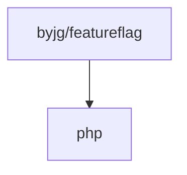

# FeatureFlag Dispatcher

[](https://github.com/byjg/php-featureflag/actions/workflows/phpunit.yml)
[](https://opensource.byjg.com)
[](https://github.com/byjg/php-featureflag/)
[](https://opensource.byjg.com/opensource/licensing.html)
[](https://github.com/byjg/php-featureflag/releases/)

A simple feature flag dispatcher.

It allows you to define a list of features and dispatch the request to the proper handler based on the enabled feature flag.

## Basic Usage

```php
// Initialize the enabled features
FeatureFlags::addFlag('flag1', 'value1');
FeatureFlags::addFlag('flag2', 'value2');
FeatureFlags::addFlag('flag3');

// Create a Dispatcher
$dispatcher = new FeatureFlagDispatcher();

// Add a feature flag handler
$dispatcher->add(FeatureFlagSelector::whenFlagIs('flag2', 'value1', function () {/** function1 */}));
$dispatcher->add(FeatureFlagSelector::whenFlagIs('flag2', 'value2', function () {/** function2 */}));
$dispatcher->add(FeatureFlagSelector::whenFlagIs('flag2', 'value3', [Someclass::class, 'method1']));

// Dispatch the request    
$dispatcher->dispatch();

// Since there is a feature flag 'flag2' with value 'value2' the function2 will be executed
```

**Note that if one or more feature flags matches the condition, all of them will be executed
in the order they were added.**

## Adding Dispatchers

- [Callables](docs/callable-dispatchers.md)
- [Attributes](docs/attribute-dispatchers.md)

## Advanced Usage

- [Search Order](docs/search-order.md)
- [Passing Arguments](docs/passing-arguments.md)


## Install

```bash
composer require "byjg/featureflag"
```

## Unit tests

```bash
vendor/bin/phpunit
```

## Dependencies



----
[Open source ByJG](https://opensource.byjg.com)
