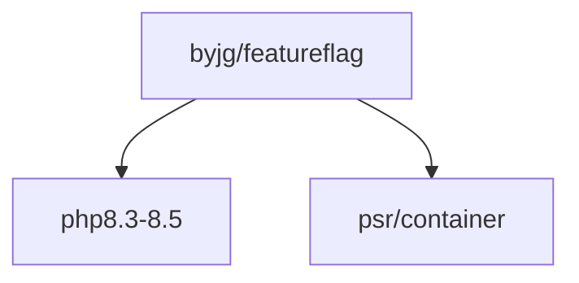

# FeatureFlag Dispatcher

[](https://github.com/sponsors/byjg)
[](https://github.com/byjg/php-featureflag/actions/workflows/phpunit.yml)
[](https://opensource.byjg.com)
[](https://github.com/byjg/php-featureflag/)
[](https://opensource.byjg.com/opensource/licensing.html)
[](https://github.com/byjg/php-featureflag/releases/)

A simple feature flag dispatcher that allows conditional code execution based on enabled feature flags.

Feature flags are a powerful technique for managing features in your application, enabling you to toggle functionality
on/off without deploying new code. This library provides a clean, interface-based approach to dispatch handlers based on
feature flag states.

## Basic Usage

```php
use ByJG\FeatureFlag\FeatureFlags;
use ByJG\FeatureFlag\FeatureFlagDispatcher;
use ByJG\FeatureFlag\FeatureFlagSelector;
use ByJG\FeatureFlag\FeatureFlagHandlerInterface;

// Initialize the enabled features
FeatureFlags::addFlag('flag1', 'value1');
FeatureFlags::addFlag('flag2', 'value2');
FeatureFlags::addFlag('flag3');

// Create handler implementations
class MyHandler implements FeatureFlagHandlerInterface
{
    public function execute(mixed ...$args): mixed
    {
        echo "Handler executed!\n";
        return null;
    }
}

// Create a Dispatcher
$dispatcher = new FeatureFlagDispatcher();

// Add feature flag handlers
$dispatcher->add(FeatureFlagSelector::whenFlagIs('flag2', 'value1', new MyHandler()));
$dispatcher->add(FeatureFlagSelector::whenFlagIs('flag2', 'value2', new MyHandler()));

// Dispatch the request
$dispatcher->dispatch();

// Since there is a feature flag 'flag2' with value 'value2', the corresponding handler will be executed
```

:::note
If one or more feature flags match the condition, **all matching handlers will be executed** in the order they were
added.
:::

## Handler Types

- [Handler Interface](docs/handler-interface.md) - Create custom handlers implementing `FeatureFlagHandlerInterface`
- [Attributes](docs/attribute-dispatchers.md) - Use PHP 8 attributes to mark methods as handlers

## Selector Types

- [FeatureFlagSelector](docs/featureflag-selector.md) - Single condition selectors
- [FeatureFlagSelectorSet](docs/featureflag-selectorset.md) - Multiple condition selectors (ALL must match)

## Advanced Usage

- [Search Order](docs/search-order.md) - Control the order of handler execution
- [Passing Arguments](docs/passing-arguments.md) - Pass runtime arguments to handlers

## Install

```bash
composer require "byjg/featureflag"
```

## Requirements

- PHP 8.3 to 8.5
- PSR-11 Container (optional, for container integration)

## Unit tests

```bash
composer test
```

## Dependencies



----
[Open source ByJG](https://opensource.byjg.com)
